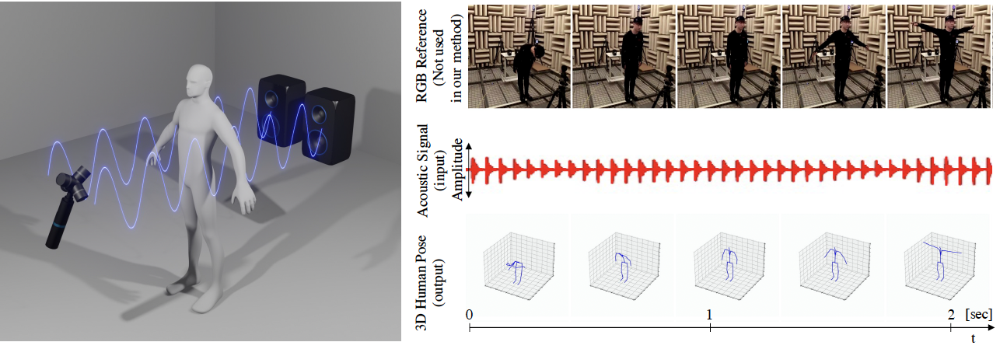

# AcousticPose

---
This repo contains the official implementation of our paper:
  
Listening Human Behavior: 3D Human Pose Estimation with Acoustic Signals 
Yuto Shibata, Yutaka Kawashima, Mariko Isogawa, Go Irie, Akisato Kimura, Yoshimitsu Aoki 
**CVPR 2023**  
[[website](https://isogawa.ics.keio.ac.jp/research_project/acoustic_3dpose.html)] [[paper](https://openaccess.thecvf.com/content/CVPR2023/papers/Shibata_Listening_Human_Behavior_3D_Human_Pose_Estimation_With_Acoustic_Signals_CVPR_2023_paper.pdf)] [[video](https://www.youtube.com/watch?v=IDvrSUautCI)]

# Installation 
### Dataset
* You can download the dataset from our project page.[1 MotionCapture](https://keio.box.com/shared/static/dc496qi861obz3a1olwtclxro61z4d5w.zip) [2. SoundData](https://keio.box.com/shared/static/dc496qi861obz3a1olwtclxro61z4d5w.zip)

### Subject assignment
* For single subject and cross subject settings, please refer to the sound and pose data file mapping shown below.

`"002":"subject_1", "004":"subject_2", "005":"subject_2", "007":'subject_3', "009":'subject_4',"010":'subject_4', "012":"subject_5", "013":'subject_5', "015":"subject_6", "016":"subject_6","018":"subject_7", "020":"subject_8", "021":"subject_8"`

# Training Steps
1. Put MotionCapture data and sound data under data folder like below.
* `pose_estimation_with_noise/data/poses`
* `pose_estimation_with_noise/data/sound`
* `pose_estimation_with_noise/data/annotations`
2. Implement sh files for dataset creation, train-validation splitting, model training and testing.
* 1. Single subject and classroom setting. 
    `sh scripts/experiment_timeseries_intensity.sh`
* 2. Cross subject and classroom setting. 
    `sh scripts/experiment_kfold_intensity.sh`
* 3. Cross subject and classroom setting with adversarial learning (Best score). 
    `sh scripts/experiment_kfold_intensity_ad.sh`
3. Check the quantitative and qualitative results in `result/experiment title`


# Citation
If you find our work useful in your research, please cite our paper
```bibtex
@InProceedings{Shibata_CVPR2023,
            author = {Shibata, Yuto and Yutaka, Kawashima and Isogawa, Mariko and Irie, Go and Kimura, Akisato and Aoki, Yoshimitsu},
            title = {Listening Human Behavior: 3D Human Pose Estimation with Acoustic Signals},
            booktitle = {The IEEE/CVF Conference on Computer Vision and Pattern Recognition (CVPR)},
            year = {2023},
            pages={13323 - 13332}
            }
```

# License

For license of this work, please refer to `license.txt`